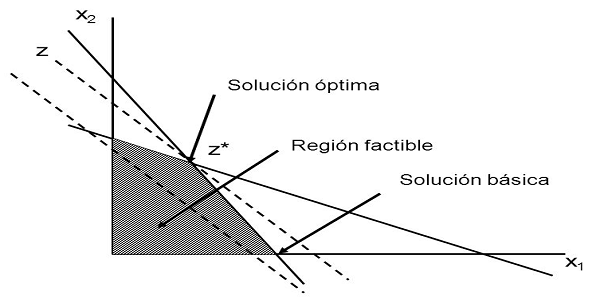

## Página de progamación lineal 

En esta página se mostrará lo cool que es esta clase que están bien padres y hacen cosas chidas en programación lineal.
 
 
 
 ## Hoy aprendí a usar esta cosa 
 
 
hola hola

## Enlaces
- [Página de Python](https://www.python.org/)
- [Página de Google](https://www.google.com/)
- [Mi página de GitHub](https://github.com/DiegoMontBar)

## Problemas

Cosas en LaTeX

$$ z=\frac{2x_1^2}{3}+x_2 $$

